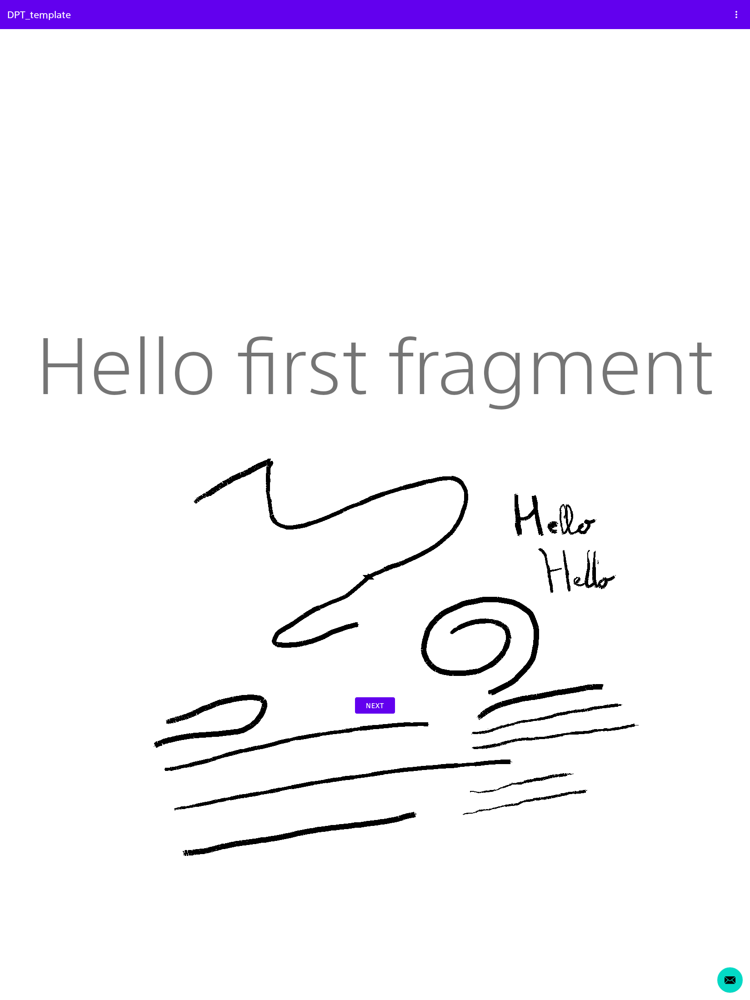

# DPT Template APK 
This is a stylus-enabled demo of a custom APK for the DPT-RP1.

## What this demontrates
* Stylus handwriting as fast as Sony
* Eraser feature, but not stroke-based (it clears a bitmap around the eraser circle
rather than detecting intersection between strokes and the eraser like Sony does)
* Stylus pressure, because yes it works

## Stylus handwriting
There are 3 ways to program handwriting for the Stylus on the DPT:

### The Android way
* Capture MotionEvent events
* Store the point/lines/whatever
* Invalidate the view, or a dirty rectangle
* Pray this doesn't redraw too late.

The performance are horrendous, this won't work

### The Software way
Sony has a special rewrite of the View class that can invalidate
a dirty rectangle in a preferential mode for E-Ink, a lot like what the Onyx lib does.

* Write a static cache to capture the Sony method at Runtime
* Run this method instead of View.Invalidate on your custom view, with a parameter
to indicate Direct Update 

This works well, but there's a 200 to 500ms delay, compared to the official app,
which is interestingly A LOT like all the early critics of the device said. Sony made an update around
2018, to "make it 30% faster"

### The Hardware way
It turns out, there's a special .so library in /lib/libSystemUtil.so, which can draw a fast squiggle
on the framebuffer, and that... makes it 30% faster. We can now store/draw to a bitmap slowly while 
pre-showing the squiggle (it's around 20px long ?) as a temporary preview.

## Stylus pressure handling
It turns out that the device is able to sense pressure like most of its competition. 
Looking for maths/geometry geniuses who can find a less naive way to make it look and animate
nicely, I don't care too much for it myself. Here is what the app looks like with pressure handling:

## TODO:
* Make pressure animate
* See if can draw the eraser circle fast enough
* Store / retrieve context-based anotation
* Make the eraser stroke-based like Sony
* Store / Retrieve strokes or at least the bitmap with event listeners
so that clients can retrieve them